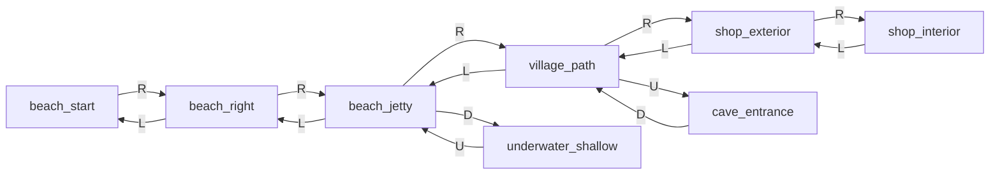

# Treasure Island Dizzy — карта экранов (vertical slice)

> Справочник для ремейка. Не копия оригинального арта 1:1.  
> Полная карта оригинала — Phase 3; здесь **8 экранов** для Phase 2 slice.

## Slice-экраны (Phase 2)

| id | Описание | Предметы / hazards | Exits |
|----|----------|-------------------|-------|
| `beach_start` | Стартовый пляж, кораблекрушение | snorkel (pickup) | R → `beach_right` |
| `beach_right` | Пляж, скала | coin ×1 | L → `beach_start`, R → `beach_jetty` |
| `beach_jetty` | Причал, мелкая вода | coin ×1, **WaterZone** (без snorkel = смерть) | L → `beach_right`, R → `village_path`, D → `underwater_shallow` |
| `village_path` | Тропа к деревне | coin ×1 | L → `beach_jetty`, R → `shop_exterior`, U → `cave_entrance` |
| `shop_exterior` | Хижина лавочника (снаружи) | — | L → `village_path`, R → `shop_interior` |
| `shop_interior` | Лавочник (NPC) | **Shopkeeper NPC** (dialog stub) | L → `shop_exterior` |
| `underwater_shallow` | Мелководье | coin ×2, **WaterZone** (snorkel = безопасно) | U → `beach_jetty` |
| `cave_entrance` | Вход в пещеру (заглушка) | coin ×1 | D → `village_path` |

## Граф переходов

## Puzzle-loop slice

1. Подобрать **snorkel** на `beach_start`
2. Дойти до `beach_jetty` — мелкая вода убивает без snorkel (демо hazard)
3. Спуститься в `underwater_shallow` — безопасно со snorkel, 2 монеты
4. Собрать монеты по пути (цель slice: **5 из 30** на карте)
5. Зайти к **лавочнику** в `shop_interior` — dialog stub (E / Pick)

## Phase 3 backlog (не в slice)

- Все ~100+ экранов оригинала
- Полные puzzle chains (ключи, двери, предметы лавочника)
- Враги, ловушки, финальный побег
- Оставшиеся 25 монет

## Источники

- [Yolkfolk — Treasure Island Dizzy](https://yolkfolk.com/games/treasure-island-dizzy/)
- [GameFAQs walkthrough](https://gamefaqs.gamespot.com/sinclair/947056-treasure-island-dizzy/faqs/65007)
